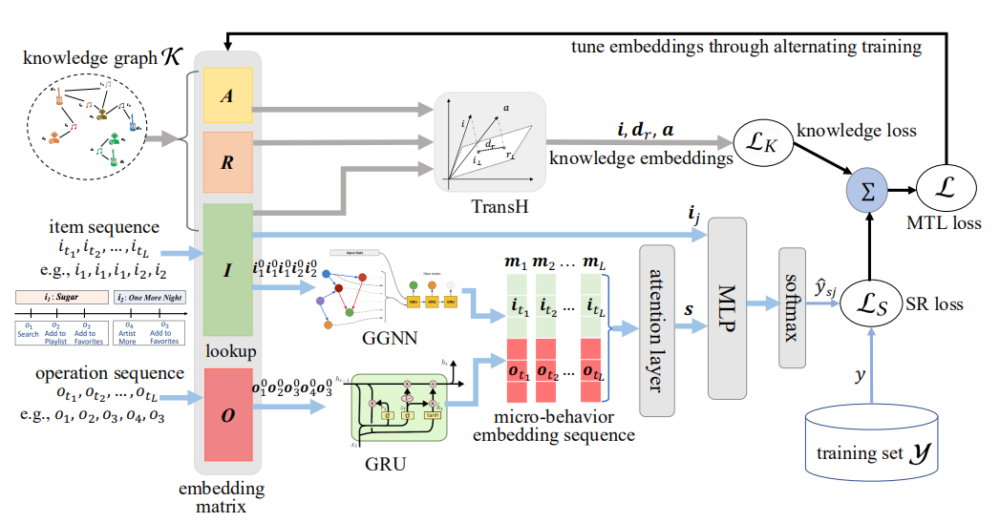
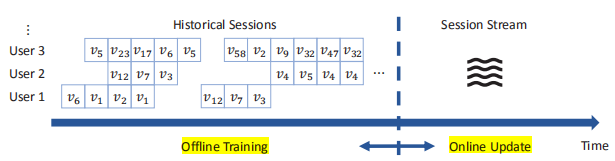
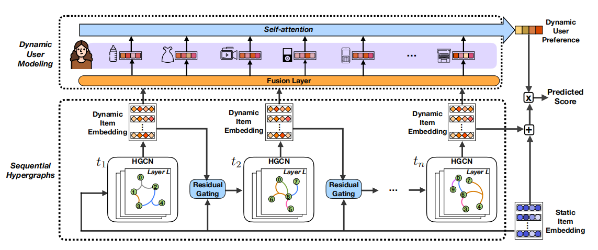

### take away message

---

**1. Joint Modeling of Local and Global Temporal Dynamics for Multivariate Time Series Forecasting with Missing Values **  AAAI 2020

> - introduction的写法：首先介绍研究的问题，再说明前人的工作及欠缺之处（针对自己的模型提出），自然引入自己的模型，对自己的模型进行说明，并解释三个贡献点。
>- abstract的写法逻辑与introduction类似，但重点是要concise。

#### SIGIR 2020

#### 序列推荐：

**2. Modeling Personalized Item Frequency Information for Next-basket Recommendation**

> - 下一个篮子推荐问题中的历史序列全都是长度大于等于一的序列（element is a set），当每个篮子中的序列长度为1时与session-based / sequential推荐和top N推荐相同。
> - 发现了PIF（personalized item frequency information）能以协作的方式对NBR（下一个篮子推荐）作出贡献的协同（collaborative）购买模式。
> - 模型的本质是  基于项目频率的k近邻(KNN)方法

**3. Incorporating User Micro-behaviors and Item Knowledge into Multi-task Learning for Session-based Recommendation**

> 1. 现有的序列推荐模型缺乏对微行为（micro-behaviors）信息的利用，物品知识信息利用不足
> 2. 微行为可以分为行为序列（GRU、LSTM）、物品序列（GGNN门控图神经网络）
> 3. 物品知识信息用知识图谱中的TransH框架来获取

**4. GAG: Global Attributed Graph Neural Network for Streaming Session-based Recommendation**

> 1. 本文主要研究的是在流媒体场景中的会话推荐问题。GAG（全局分布图神经网络）分为离线静态数据训练模型，在线会话流更新模型这两个部分。
> 2. 模型中使用了Wasserstein reservoir来保存数据。

**5. Sequential Recommendation with Self-Attentive Multi-Adversarial Network**

> 1. MFGAN是第一个将生成对抗网络（GAN）加入到推荐系统中的模型。

**6. A Generic Network Compression Framework for Sequential Recommender Systems**

> 1. CpRec模型解决了一般的神经网络序列推荐模型中需要训练大量参数的问题，也压缩了模型大小。
>
> 分块自适应分解、三种分层参数共享方案、空洞卷积核

**7. Next-item Recommendation with Sequential Hypergraphs**

> 1. 模型结构：residual gating layer（融合dynamic item embeddings和static item embeddings） -->  HGCN（超图卷积神经网络） -->  fusion layer（得到每个用户-物品交互结合dynamic item embeddings和static item embeddings之后的表达） -->  self-attention

**8. Time Matters: Sequential Recommendation with Complex Temporal Information**

> 1. 利用RNN进行序列信息的建模会丢失一些序列信息，本文提出的TASER模型通过分别对用户行为序列的绝对时间特征和相对时间特征进行处理，更好的利用了序列中的时间信息。
> 2. 绝对时间特征强调直接将序列行为和时间戳联系起来，相对时间特征强调行为之间的时间间隔。

**9. KERL: A Knowledge-Guided Reinforcement Learning Model for Sequential Recommendation**

> 1. 强化学习的优点：考虑序列问题，具有长远眼光，考虑长期回报。
>
>    exploitation and exploration
>
> 2. motivation：强化学习中交互数据稀疏、盲目或随机的探索来捕捉用户兴趣变化不可靠。因此考虑使用KG来进行knowledge-guided。
>
> 3. 模型中将知识图谱与强化学习结合进序列推荐问题中——马尔可夫决策过程（MDP）。
>
> 4. 三个技术扩展——状态表示、奖励函数、学习算法：
>
>    - 序列级状态表示（GRU）和知识级状态表示（平均池化、平均池化＋多层感知机）
>    - 序列级奖励函数和知识级奖励函数

RecSys的推荐方向概述：

- 强化学习
- 推荐系统领域的个性化，不仅仅体现在每一个用户的个性化偏好，也体现在个性化的推荐领域。
- 获取用户信息记录进行用户偏好建模的问题需要考虑到隐私和安全问题
- Contextual上下文信息
- Transformer和BERT
- 系统过滤
- 多模态推荐

LSTM Attention 超图 Transformer Network GAN